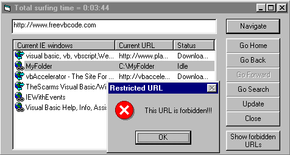

## Control ALL IE windows

### Description

This code provides control over all opened IE windows, as well as new windows opened while the application is running. You can receive events from every IE window - such as BeforeNavigate, DownloadBegin/Complete, Document complete, Mouse events, ContextMenu popup etc. This allows you to calculate total surfing time, prohibit access to designated URL (this future allow you skip banners), and more. You also can manipulate any IE window - Navigate, goBack/Forward/Home/Search, Update and Close them. Sample form use 9 mostly used events, but you can use more then 30 events!
 
### More Info
 

             |
---                |---
**Submitted On**   |2000-09-03 19:24:46
**By**             |[Ark](https://github.com/Planet-Source-Code/PSCIndex/blob/master/ByAuthor/ark.md)
**Level**          |Advanced
**User Rating**    |4.7 (104 globes from 22 users)
**Compatibility**  |VB 5\.0, VB 6\.0
**Category**       |[Internet/ HTML](https://github.com/Planet-Source-Code/PSCIndex/blob/master/ByCategory/internet-html__1-34.md)
**World**          |[Visual Basic](https://github.com/Planet-Source-Code/PSCIndex/blob/master/ByWorld/visual-basic.md)
**Archive File**   |[CODE\_UPLOAD9561932000\.zip](https://github.com/Planet-Source-Code/ark-control-all-ie-windows__1-11150/archive/master.zip)

